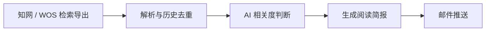

# 文献 AI 筛选与邮件简报工作流

> 将知网 / WOS 导出的检索结果自动去重、分级，并整理成一封带判定理由和原文入口的阅读简报。

[在线证据页](https://curious-leila.github.io/literature-tracker/)

---

## 30 秒了解项目

准备毕业论文时，我需要持续跟踪“翻译学 × 文化记忆”这一小众交叉领域。知网和 WOS 的检索结果格式不同，不同关键词还会带来重复文献；每次检索后，我都要重新合并、去重，再逐篇判断是否值得阅读。

我把这段重复流程做成了一个小型自动化工具：用户将导出的检索文件放入项目目录后，系统自动解析、历史去重、判断相关度，最后通过邮件发送按阅读优先级整理好的文献简报。

这不是面向所有研究场景的通用平台，而是从自己的真实需求出发完成的一套可运行工作流。

### 项目信息

| 项目维度 | 说明 |
|---|---|
| 项目类型 | 个人效率工具 / AI 自动化工作流 |
| 项目时间 | 2026.05 |
| 我的角色 | 需求定义、产品设计、Prompt 调优、开发与部署 |
| 目标用户 | 需要长期跟踪特定研究方向的学生、研究者 |
| 当前状态 | 工作流可运行，真实结果可复算，证据页已上线 |

---

## 要解决的问题

- **来源分散**：知网与 WOS 的导出格式不同，需要手工合并；
- **重复文献多**：跨关键词、跨批次检索容易出现相同论文；
- **关键词不等于相关**：标题命中关键词，不代表研究对象和理论框架真正相关。

因此，项目目标被收敛为：

> 用户完成平台检索并导出文件后，系统自动完成文献去重和相关度分级，最终通过邮件交付一份包含判定理由、阅读建议和原文入口的文献简报。

---

## 产品方案



检索策略和学校权限仍由用户控制，自动化从文件导入开始。系统将文献分成三档，并直接对应阅读动作：

- **HIGH**：优先阅读全文；
- **MEDIUM**：先浏览摘要；
- **LOW**：作为背景参考。

每篇文献同时保留判定理由、研究交叉点、阅读建议和原文入口，减少用户收到结果后的二次整理。

---

## 关键产品判断

| 问题 | 选择 |
|---|---|
| 自动抓取会受到学校权限限制 | 保留人工检索导出，把自动化重点放在后续筛选 |
| 单纯关键词筛选误判较多 | 用 LLM 判断研究对象与理论框架，并要求说明理由 |
| 分类标签本身不能指导阅读 | 将三级结果直接映射为三种阅读动作 |
| 重复运行可能再次推送旧文献 | 用 SQLite 保存历史文献和推送状态 |
| 模型或邮件服务可能失败 | 分析不完整不写入，邮件失败保留待推送状态 |

---

## Prompt 调优

项目共进行了 8 轮 Prompt 与模型调整，主要解决了三个问题：

1. 将不稳定的 JSON 改为管道分隔格式，使批量结果能够稳定解析；
2. 同时加入正向条件和负面排除规则，减少“标题相关、研究角度无关”的误判；
3. 从 Qwen 7B 升级到 Qwen2.5-32B，获得更具体的判定理由和当前真实运行结果。

完整过程见 [Prompt 迭代记录](docs/prompt-tuning-log.md)。

---

## 真实运行结果

以下数据来自 5 份真实检索导出文件，由脚本从原始文件和脱敏运行快照交叉计算：

| 运行结果 | 数量 |
|---|---:|
| 输入文件 | 5 份 |
| 解析记录 | 161 条 |
| 去重后文献 | 159 篇 |
| 高 / 中 / 低相关 | 12 / 61 / 86 篇 |
| 保留原文入口 | 156 / 159 篇 |
| 结构化结果成功解析 | 159 / 159 条 |

**159 / 159 表示程序成功解析全部结构化结果，不代表分类准确率。** 当前没有人工金标集，因此不使用未经验证的准确率作为项目结论。

可以在[在线证据页](https://curious-leila.github.io/literature-tracker/)查看三档案例和全部记录；仓库同时保留了[运行快照](data/recorded-run.json)、[复算脚本](scripts/build_evidence.py)和[一致性测试](tests/test_evidence.py)。

---

## 我完成的工作

- 从自己的论文阅读流程中识别重复需求，并划定人工检索与自动处理的边界；
- 设计三级相关度、阅读动作和 Prompt 规则，完成 8 轮调优；
- 实现双格式解析、历史去重、异常处理和邮件推送；
- 将真实运行结果固化为公开快照、证据页和自动化测试；
- 完成工作流部署与每周自动运行配置。

---

## 技术与运行

主要使用 Python、SQLite、SiliconFlow Qwen2.5-32B、SMTP 和 GitHub Actions。

```bash
pip install -r requirements.txt
python pipeline.py
```

运行前需参考 [`.env.example`](.env.example) 配置模型和邮箱信息。

---

## 当前边界

- 每周约 2 小时是需求阶段的自述估算，没有受控计时，因此不声称具体提效倍数；
- 当前没有独立人工金标评测，不声称具体分类准确率；
- 目前只在自己的研究主题中完成真实运行，其他应用场景尚未验证。
